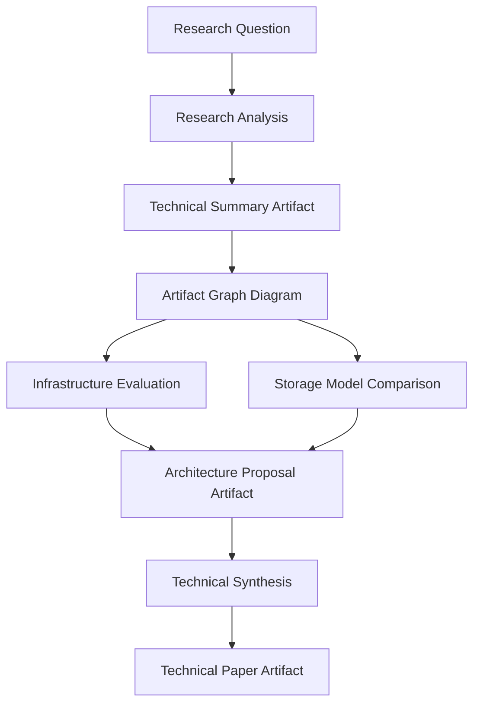

## Abstract

Autonomous computational systems increasingly produce large numbers of artifacts representing the results of computation. These artifacts form dependency graphs that encode accumulated computational work.

Preserving artifact availability ensures that artifacts remain accessible across distributed systems. However, preservation alone is insufficient if artifacts cannot be uniquely and verifiably identified.

This document introduces **Deterministic Artifact Identity**, a model in which artifact identity is derived from the computation that produced the artifact and the artifacts used as inputs.

Deterministic artifact identity allows artifact graphs to become verifiable representations of computational work and provides the mechanism required to implement the Artifact Availability Layer introduced in the previous note.

---

## Opening Statement

Artifacts must not only persist.

They must also be **identifiable in a way that reflects the computation that produced them**.

Without deterministic identity, artifact graphs cannot be verified and computational work cannot be reliably preserved.

---

## The Problem with Conventional Artifact Identity

Most computational systems identify outputs using arbitrary identifiers.

Examples include:

- file paths  
- database primary keys  
- object storage keys  
- randomly generated unique identifiers  

These identifiers provide references to stored data but reveal nothing about the computation that produced the artifact.

As a result:

- artifact identity depends on storage location  
- artifact identity cannot verify computational lineage  
- artifact graphs cannot be validated  

In large computational ecosystems this makes artifact graphs fragile and difficult to verify.

---

## Deterministic Artifact Identity

A different approach is possible.

Instead of assigning arbitrary identifiers, artifact identity can be derived from the **computation that produced the artifact and the artifacts used as inputs**.

Deterministic artifact identity can be expressed conceptually as:

```
artifact_id = f(computation, input_artifacts)
```

Under this model:

- identical computations using identical inputs produce identical artifact identities  
- artifact identity becomes independent of storage location  
- artifact graphs become structurally verifiable  

Artifacts become deterministic nodes within the artifact graph.

---

## Verifiable Computational Results

Deterministic artifact identity enables verification of computational results.

Given:

- an artifact  
- the inputs used to produce it  
- the computation that produced it  

the computation can be executed again.

If the resulting artifact produces the same identity, the artifact has been verified.

Artifact graphs therefore become **verifiable representations of computational work** rather than informal traces of system activity.

---

## Determinism in Practice

Deterministic artifact identity is easiest to apply in computational systems where identical inputs and computations reliably produce identical outputs.

Examples include:

- data transformation pipelines  
- deterministic simulations  
- software build systems  
- data processing workflows  

In these environments, identical computations produce identical artifacts, allowing systems to reuse existing artifacts and avoid unnecessary recomputation.

However, many modern computational systems — particularly those involving machine learning models or autonomous agents — include **stochastic elements**.

In these systems repeated execution may produce artifacts that differ slightly even when the inputs appear identical.

In such cases deterministic artifact identity still provides value.

Rather than guaranteeing identical artifacts, deterministic identity provides a **stable description of the computational context** in which an artifact was produced.

Artifacts generated under the same computational context may still receive distinct identities when their outputs differ, but the artifact graph preserves the lineage of computation that produced them.

In stochastic systems, artifact identity describes the **computational context in which an artifact was produced**, not necessarily the exact bytes of the resulting artifact.

This allows systems to:

- trace computational provenance  
- analyze variations in outcomes  
- organize families of related artifacts  
- preserve verifiable records of computational work  

Deterministic artifact identity therefore supports both:

1. **Artifact reuse** in deterministic workflows  
2. **Computational lineage tracking** in stochastic workflows

---

## Practical Implementation

The Artifact Availability Layer introduced in the previous note can use deterministic artifact identity to maintain artifact graphs across distributed systems.

A practical implementation requires three core components.

### Artifact Registry

A registry records artifact identities and the relationships between artifacts.

Each artifact record contains:

- artifact identity  
- producing computation  
- input artifact identities  
- artifact metadata  

This registry functions as the **index of the artifact graph**.

---

### Artifact Storage

Artifacts themselves are stored in durable storage systems.

The Artifact Availability Layer does not replace storage infrastructure.

Instead, it ensures that stored artifacts remain associated with their identities and derivation relationships.

Multiple storage systems may be used simultaneously.

---

### Artifact Graph Preservation

When new artifacts are produced, the system records the relationship between the artifact and its inputs.

Over time this produces a continuously evolving artifact graph representing accumulated computational work.

---

## Example: Cross‑System Artifact Reuse

Consider a research workflow involving multiple computational systems performing different roles.

A user begins with a question:

> Analyze the architectural implications of preserving computational artifacts in distributed computational systems.

### Step 1 — Initial Research

A research analysis system produces:

- a technical summary  
- a conceptual diagram of artifact graphs  
- a collection of architectural references  

```
research_question
      ↓
technical_summary
      ↓
artifact_graph_diagram
```

---

### Step 2 — Parallel Evaluation

Two independent systems extend the work simultaneously.

An infrastructure evaluation system produces:

- infrastructure analysis

A comparative analysis system produces:

- storage model comparison

```
artifact_graph_diagram
      ↓        ↓
infrastructure_analysis   storage_model_comparison
```

---

### Step 3 — System Design

A design system synthesizes the previous artifacts to produce:

```
infrastructure_analysis
          ↓
     architecture_proposal
          ↑
storage_model_comparison
```

---

### Step 4 — Final Synthesis

A documentation system produces the final artifact:

```
architecture_proposal
        ↓
technical_paper
```

The artifact graph now represents the accumulated computational work of multiple systems.

Without artifact preservation, each system would repeat much of the same work.

With artifact graphs, computational work accumulates across systems.

Independent systems become participants in a **shared artifact graph representing accumulated computational work**.

---

## Artifact Graph Across Computational Roles



*Processes perform computation, but artifacts preserve the results of computation.  
Over time, artifact graphs become the durable record of accumulated computational work.*

---

## Implications

Deterministic artifact identity changes how computational systems manage results.

Artifacts become verifiable computational objects.

Artifact graphs become durable representations of computational work.

Independent computational systems can contribute artifacts to a shared graph of accumulated work.

Instead of repeatedly recomputing results, computational ecosystems can **extend prior computation**.

---

## Conclusion

Preserving computational work requires more than durable storage.

Artifacts must possess identities that reflect the computations that produced them. Deterministic artifact identity provides this capability by linking artifacts directly to the computational processes and inputs from which they originate.

When combined with the Artifact Availability Layer, deterministic identity enables artifact graphs to become verifiable records of computational lineage. Systems can confirm the origin of artifacts, trace the relationships between derived results, and maintain the integrity of computational work across distributed environments.

These capabilities extend beyond simple reproducibility. When artifact graphs remain available and verifiable, computational systems gain the ability to accumulate work rather than repeatedly recreating it. Each new artifact becomes a durable extension of prior computation, allowing future systems to continue from where earlier computation concluded.

Deterministic artifact identity therefore provides a foundational mechanism through which computational work can persist, remain verifiable, and accumulate value across distributed computational systems.

In this way, deterministic artifact identity allows computational systems not merely to repeat work, but to build upon it.

When artifact identity and artifact availability are combined, artifact graphs become durable and verifiable representations of computational work. The next note examines the implications of this property through the principle of Computational Work Conservation.

---

## Discussion and Feedback

The ideas presented in this document are part of an ongoing exploration of architectural requirements for agent‑based computational systems.

Comments, critiques, and alternative perspectives are encouraged.

Feedback may be submitted through issues or discussions within this repository.

The next note in this series establishes the principle of Computational Work Conservation.

---

## Citation

If referencing this work, please cite:

Kopcho, Rich. *Deterministic Artifact Identity.*  
Agent Artifact Availability (AAA) Series. Technical Note, March 2026.
